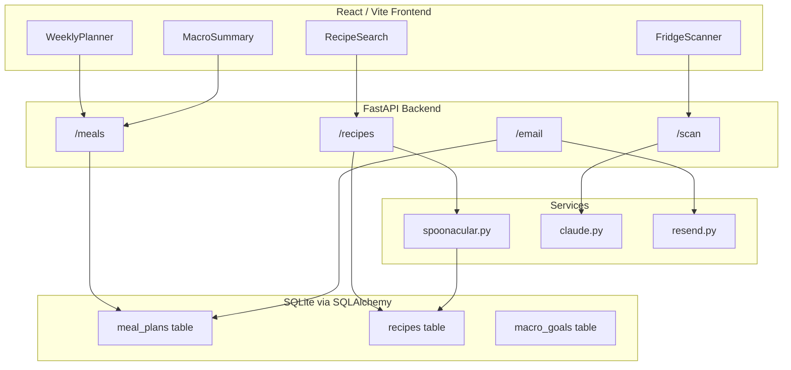

# Meal Planner App — Build Plan

## Architecture



## Project Structure

```
meal prep/
├── backend/
│   ├── main.py               # FastAPI app entry point, CORS, cron scheduler
│   ├── database.py           # SQLAlchemy engine + session
│   ├── models/
│   │   └── models.py         # Recipe, MealPlan, MacroGoals ORM models
│   ├── routes/
│   │   ├── meals.py          # CRUD for weekly meal plan slots
│   │   ├── recipes.py        # Search/favorite recipes via Spoonacular
│   │   ├── scan.py           # Fridge photo → Claude → ingredient list → recipes
│   │   └── email.py          # Trigger/schedule weekly digest
│   ├── services/
│   │   ├── claude.py         # Anthropic image recognition
│   │   ├── spoonacular.py    # Recipe search + nutrition fetch
│   │   └── resend.py         # Email composition + send
│   └── requirements.txt
├── frontend/
│   ├── src/
│   │   ├── components/
│   │   │   ├── WeeklyPlanner.tsx   # Mon–Sun grid with 3 meal slots/day
│   │   │   ├── MacroSummary.tsx    # Daily + weekly macro bars
│   │   │   ├── FridgeScanner.tsx   # Image upload + ingredient results
│   │   │   └── RecipeCard.tsx      # Displays recipe + macros
│   │   ├── pages/
│   │   │   ├── Planner.tsx
│   │   │   ├── Goals.tsx
│   │   │   └── Scanner.tsx
│   │   ├── api/              # Typed fetch wrappers for each backend route
│   │   ├── App.tsx
│   │   └── main.tsx
│   ├── package.json
│   └── vite.config.ts
├── .env                      # All API keys (gitignored)
└── .gitignore
```

## Database Schema

- **recipes** — `id`, `spoonacular_id`, `title`, `image_url`, `calories`, `protein`, `carbs`, `fat`, `ingredients_json`, `favorited`, `source_url`
- **meal_plans** — `id`, `week_start_date`, `day_of_week` (0–6), `meal_type` (breakfast/lunch/dinner), `recipe_id` (FK → recipes)
- **macro_goals** — `id`, `calories`, `protein`, `carbs`, `fat` (single-row settings table)

## Backend Key Details

- **`main.py`** — mounts routes, configures CORS for `localhost:5173`, uses `APScheduler` to fire the Sunday email cron at 18:00
- **`/meals` routes** — GET week by `?week_start=YYYY-MM-DD`, PUT to assign a recipe to a slot, DELETE to clear a slot, POST `/meals/autogenerate` to fill a week from macro goals
- **`/recipes` routes** — GET `/recipes/search?query=...` proxies Spoonacular, GET `/recipes/{id}` fetches + caches in SQLite, POST `/recipes/{id}/favorite`
- **`/scan`** — accepts `multipart/form-data` image, base64-encodes it, sends to Claude with prompt `"Return a JSON array of ingredient names visible in this fridge photo."`, then calls Spoonacular ingredient search
- **`/email/send`** — builds HTML email from current week's plan (recipe names, macros, aggregated shopping list) and sends via Resend

## Frontend Key Details

- **`WeeklyPlanner.tsx`** — 7-column grid, each cell has a `RecipeCard` or an "Add" button that opens a recipe search drawer; "Auto-Generate Week" button hits `/meals/autogenerate`
- **`MacroSummary.tsx`** — horizontal progress bars for calories/protein/carbs/fat per day and week total vs. goals from `/goals`
- **`FridgeScanner.tsx`** — drag-and-drop image upload, shows detected ingredients as chips, lists suggested recipes from Spoonacular
- State management via React Query (server state) + Zustand (goals/UI state)

## Environment Variables (`.env`)

```
ANTHROPIC_API_KEY=
SPOONACULAR_API_KEY=
RESEND_API_KEY=
EMAIL_RECIPIENT=
```

## Build Order (implementation sequence)

1. Backend scaffolding: `database.py`, `models.py`, `main.py` with health check
2. Meals + recipes routes + Spoonacular service
3. React frontend: Vite scaffold, WeeklyPlanner grid, RecipeCard, API wrappers
4. MacroGoals page + MacroSummary component wired to backend
5. FridgeScanner route + Claude service + frontend Scanner page
6. Weekly email: Resend service + cron scheduler + email route
7. `.env.example`, `.gitignore`, README
