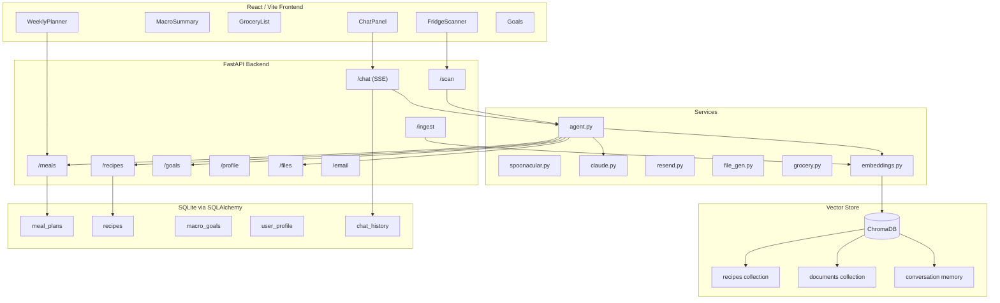

# Meal Planner App — Build Plan

## Current Status

**Phase 1 and Phase 2 are complete.** The app focuses on nutrition-driven meal planning and grocery lists. Store pricing has been removed.

**Phase 3 (next):** RAG-powered copilot — a chat interface where users talk to an agent that can read their plan, query a vector store of recipes and custom documents, and take actions (assign slots, autogenerate, build grocery lists) entirely through conversation.

---

## Product Focus

| In scope | Out of scope (for now) |
|----------|------------------------|
| Search and cache recipes with full nutrition data | Kroger / live store pricing |
| Set daily macro goals (calories, protein, carbs, fat) | Weekly budget tracking |
| Auto-generate a week that hits macro targets | `estimated_cost` on recipes |
| Build grocery lists from planned meals | Store location configuration |
| Diet type + allergen filters on search | Price columns in exports/email |
| Fridge scan → ingredient-based recipe suggestions | |
| RAG over recipe cache + custom documents | |
| Agent copilot with tool-use (plan, assign, generate) | |
| Preference memory across conversations | |

---

## Architecture



---

## Project Structure

```
meal-prep/
├── backend/
│   ├── main.py
│   ├── database.py
│   ├── models/models.py          # Recipe, MealPlan, MacroGoals, UserProfile, ChatHistory
│   ├── routes/
│   │   ├── meals.py              # Week CRUD + autogenerate
│   │   ├── recipes.py            # Search, fetch, favorite
│   │   ├── goals.py              # Macro targets
│   │   ├── profile.py            # Diet + allergens
│   │   ├── scan.py               # Fridge photo → agent
│   │   ├── files.py              # Grocery list + recipe book exports
│   │   ├── email.py              # Weekly digest
│   │   ├── chat.py               # SSE chat endpoint, session management
│   │   └── ingest.py             # Upload + embed custom documents
│   └── services/
│       ├── spoonacular.py
│       ├── claude.py             # Image detection + agent LLM calls
│       ├── resend.py
│       ├── file_gen.py           # HTML generators
│       ├── grocery.py            # Ingredient aggregation + categorization
│       ├── agent.py              # Agent loop, tool dispatch, response streaming
│       └── embeddings.py         # ChromaDB client, upsert/query helpers
├── frontend/
│   └── src/
│       ├── components/
│       │   ├── WeeklyPlanner.tsx
│       │   ├── MacroSummary.tsx
│       │   ├── RecipeCard.tsx
│       │   ├── FridgeScanner.tsx
│       │   ├── GroceryList.tsx
│       │   └── ChatPanel.tsx     # Message thread, streaming tokens, action cards
│       ├── pages/
│       │   ├── Planner.tsx
│       │   ├── Goals.tsx
│       │   ├── Scanner.tsx
│       │   ├── Profile.tsx
│       │   └── Chat.tsx          # Full chat page with doc upload
│       └── api/
│           ├── meals.ts
│           ├── recipes.ts
│           ├── files.ts
│           ├── profile.ts
│           └── chat.ts           # SSE client wrapper
├── .env.example
├── .gitignore
└── README.md
```

---

## Database Schema

**Existing (unchanged):**
- **recipes** — `id`, `spoonacular_id`, `title`, `image_url`, `calories`, `protein`, `carbs`, `fat`, `ingredients_json`, `instructions_json`, `favorited`, `source_url`
- **meal_plans** — `id`, `week_start_date`, `day_of_week` (0–6), `meal_type` (breakfast/lunch/dinner), `recipe_id` (FK)
- **macro_goals** — `id`, `calories`, `protein`, `carbs`, `fat` (single-row)
- **user_profile** — `id`, `allergens_json`, `diet_type`

**New for Phase 3:**
- **chat_history** — `id`, `session_id`, `role` (user/assistant/tool), `content`, `created_at`
- **chat_memory** — `id`, `session_id`, `summary`, `created_at` (condensed per-session preference summaries)

**Vector collections (ChromaDB):**
- **recipes** — one document per cached recipe; metadata: `recipe_id`, `title`, `calories`, `protein`, `carbs`, `fat`, `diet_type`, `favorited`
- **documents** — user-uploaded files chunked into ~500-token passages; metadata: `filename`, `page`, `source`
- **memory** — condensed conversation summaries per session

---

## Phase 1 — Completed

1. Backend scaffolding (`database.py`, models, `main.py`, CORS, APScheduler Sunday 18:00 cron)
2. Meals + recipes routes + Spoonacular service
3. React frontend: Vite, WeeklyPlanner, RecipeCard, API wrappers
4. MacroGoals page + MacroSummary component
5. FridgeScanner + Claude scan route
6. Weekly email via Resend + manual send from planner
7. `.env.example`, `.gitignore`, README
8. File exports (grocery list HTML, recipe book HTML)
9. User profile with diet/allergens

---

## Phase 2 — Completed

1. Removed Kroger pricing, BudgetTracker, store/budget profile fields
2. Multi-macro autogenerate (protein-weighted scoring, favorites-first, Spoonacular seeding)
3. Recipe flow — full nutrition on assign, favorites tab in planner drawer, macro gap banner
4. Grocery list — JSON endpoint, in-app categorized view with localStorage checkboxes
5. Simplified email/exports — ingredient checklist, no pricing
6. Removed Zustand, updated README and `.env.example`

---

## Phase 3 — RAG Copilot

### Overview

Add a persistent chat panel powered by a Claude agent with tool-use. The agent retrieves context from ChromaDB (recipe embeddings + user-uploaded documents + conversation memory) before responding, and can take actions on the meal plan directly through tool calls.

**Example interactions:**
- "What am I making Thursday?" → reads meal plan
- "High protein week, no dairy" → calls autogenerate with profile context
- "Swap Tuesday dinner for something under 500 cal" → semantic recipe search → assigns slot
- "I scanned my fridge — plan 3 dinners from what I have" → fridge scan + agent planning
- "Make something like my mom's chili but fit my macros" → RAG over uploaded docs
- "Am I on track for protein this week?" → reads macro totals, explains gap

---

### 3a. Embeddings + vector store

**New:** `backend/services/embeddings.py`

- ChromaDB (local persistent mode, no server needed)
- Two collections: `recipes` and `documents`
- Recipe embedding text: `"{title}. Macros: {cal}kcal, {protein}g protein, {carbs}g carbs, {fat}g fat. Ingredients: {ingredients}. Instructions: {instructions}"`
- Embed on: recipe upsert (add to existing `_upsert_recipe`), and a one-time backfill endpoint `POST /ingest/backfill`
- Query: top-k cosine similarity, return recipe IDs or doc chunk text
- Embedding model: `text-embedding-3-small` (OpenAI) **or** Anthropic embeddings (same API key already in use)

> Note: if staying Claude-only, use a lightweight local model (e.g. `sentence-transformers`) or switch to OpenAI embeddings — both are small additions to `requirements.txt`.

---

### 3b. Agent tools

**New:** `backend/services/agent.py`

Define Claude tool-use functions. Each tool maps to an existing backend capability:

| Tool name | What it does |
|-----------|-------------|
| `get_current_week` | Returns the week's slots and macro totals |
| `get_macro_goals` | Returns daily macro targets |
| `search_recipes_semantic` | Queries ChromaDB recipe collection |
| `search_recipes_spoonacular` | Calls Spoonacular (fallback for fresh results) |
| `assign_slot` | PUT a recipe to a day/meal slot |
| `clear_slot` | DELETE a slot |
| `autogenerate_week` | POST /meals/autogenerate |
| `get_grocery_list` | Returns structured ingredient list |
| `get_profile` | Returns diet + allergens |
| `search_documents` | Queries ChromaDB documents collection |

The agent loop:
1. Retrieve relevant context (recent memory + RAG top-k)
2. Call Claude with system prompt + conversation history + retrieved context + tool definitions
3. If Claude returns tool calls → execute → append results → loop
4. Stream final text response tokens to the client via SSE

---

### 3c. Chat route

**New:** `backend/routes/chat.py`

```
POST /chat
Body: { session_id, message, context?: { scan_result? } }
Response: SSE stream of { type: "token"|"tool_call"|"tool_result"|"done" }
```

- Session ID (UUID from frontend) scopes history and memory
- On each request: load last N messages + retrieve memory summary + run agent loop
- Persist each turn to `chat_history` table
- After N turns, condense history into a memory summary embedding and store in `memory` collection

---

### 3d. Document ingest

**New:** `backend/routes/ingest.py`

```
POST /ingest/document  — multipart upload (PDF or text)
POST /ingest/backfill  — embed all existing cached recipes
GET  /ingest/documents — list indexed documents
DELETE /ingest/documents/{id} — remove from vector store
```

- PDFs parsed with `pypdf`
- Chunk at ~500 tokens with 50-token overlap
- Each chunk embedded and upserted into `documents` collection
- Metadata: filename, chunk index, page number

---

### 3e. Chat UI

**New:** `frontend/src/components/ChatPanel.tsx` + `frontend/src/pages/Chat.tsx`

- Full page (`/chat`) reachable from nav
- Message thread: user bubbles left, assistant right, streaming tokens
- **Action cards** — when agent assigns a slot or autogenerates, show a confirmation card ("Added Grilled Salmon → Thursday dinner ✓")
- **Citation chips** — when agent retrieves a recipe from RAG, show the source recipe name as a tappable chip
- Input bar with optional image attachment (triggers fridge scan → agent instead of the standalone scanner)
- Doc upload button → `POST /ingest/document`
- After agent completes an action, invalidate React Query keys (`["week"]`, `["grocery-list"]`) so planner updates live

---

### 3f. Upgrade fridge scanner to agent entry point

Current: `POST /scan` → Claude vision → ingredient list → Spoonacular suggestions → static list.

Phase 3: after extracting ingredients, hand off to the agent:
```
"I found these ingredients in your fridge: [eggs, spinach, chicken, lemon].
 Your goals are 2500 kcal, 180g protein. You have 3 empty dinner slots this week.
 Plan those dinners using what's available."
```

The agent can then call `search_recipes_semantic`, `assign_slot`, and `get_grocery_list` to produce a natural-language plan with actions taken.

---

### 3g. Conversation memory

After every 10 turns:
1. Call Claude to summarize the session: preferences, dislikes, frequently used recipes, goals mentioned
2. Embed the summary
3. Upsert into `memory` collection keyed by `session_id`
4. On future sessions, retrieve similar memories at start of each conversation

This lets the agent say "I remember you said you don't like cilantro" without re-reading full history.

---

## API Summary

| Route | Purpose |
|-------|---------|
| `GET /health` | Health check |
| `GET /meals?week_start=` | Week plan + daily/weekly macro totals |
| `PUT /meals/{day}/{meal_type}` | Assign recipe to slot |
| `DELETE /meals/{day}/{meal_type}` | Clear slot |
| `POST /meals/autogenerate` | Fill empty slots using macro goals |
| `GET /recipes/search?query=` | Spoonacular search (respects profile filters) |
| `GET /recipes/{id}` | Fetch + cache recipe |
| `POST /recipes/{id}/favorite` | Toggle favorite |
| `GET/PUT /goals` | Daily macro targets |
| `GET/PUT /profile` | Diet type + allergens |
| `POST /scan` | Image → agent → plan actions |
| `GET /files/grocery-list/data` | Grocery list JSON |
| `GET /files/grocery-list` | Grocery list HTML download |
| `GET /files/recipe-book` | Recipe book HTML download |
| `POST /email/send` | Send weekly digest |
| `POST /chat` | SSE agent chat stream |
| `POST /ingest/document` | Upload + embed a document |
| `POST /ingest/backfill` | Embed all cached recipes |
| `GET /ingest/documents` | List indexed documents |
| `DELETE /ingest/documents/{id}` | Remove document from index |

---

## Environment Variables

```
ANTHROPIC_API_KEY=        # Claude (vision + agent reasoning)
SPOONACULAR_API_KEY=      # Recipe search + nutrition
RESEND_API_KEY=           # Weekly email digest
EMAIL_RECIPIENT=          # Digest recipient address
OPENAI_API_KEY=           # Optional — only needed if using OpenAI embeddings
```

---

## Build Order (Phase 3)

1. **Embeddings service** — ChromaDB setup, `embeddings.py`, backfill endpoint for existing recipes
2. **Agent tools** — `agent.py` with tool definitions, Claude tool-use loop, SSE streaming
3. **Chat route** — `POST /chat`, session + history persistence, memory condensation
4. **Chat UI** — `ChatPanel.tsx`, `Chat.tsx`, SSE client, action cards, citation chips
5. **Doc ingest** — `ingest.py`, PDF parsing, chunk + embed pipeline, document management UI
6. **Scanner upgrade** — wire scan results into agent instead of static Spoonacular list
7. **Memory** — per-session preference summaries, retrieval at conversation start
