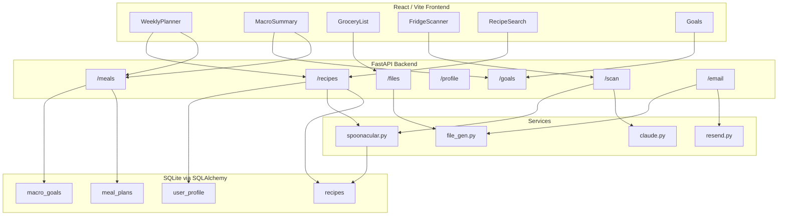

# Meal Planner App — Build Plan

## Current Status

**Phase 1 and Phase 2 are complete.** The app focuses on nutrition-driven meal planning and grocery lists. Store pricing has been removed.

---

## Product Focus

| In scope | Out of scope (for now) |
|----------|------------------------|
| Search and cache recipes with full nutrition data | Kroger / live store pricing |
| Set daily macro goals (calories, protein, carbs, fat) | Weekly budget tracking |
| Auto-generate a week that hits macro targets | `estimated_cost` on recipes |
| Build grocery lists from planned meals | Store location configuration |
| Diet type + allergen filters on search | Price columns in exports/email |
| Fridge scan → ingredient-based recipe suggestions | |

---

## Architecture



---

## Project Structure

```
meal-prep/
├── backend/
│   ├── main.py
│   ├── database.py
│   ├── models/models.py          # Recipe, MealPlan, MacroGoals, UserProfile
│   ├── routes/
│   │   ├── meals.py              # Week CRUD + autogenerate
│   │   ├── recipes.py            # Search, fetch, favorite
│   │   ├── goals.py              # Macro targets
│   │   ├── profile.py            # Diet + allergens
│   │   ├── scan.py               # Fridge photo → ingredients → recipes
│   │   ├── files.py              # Grocery list + recipe book exports
│   │   └── email.py              # Weekly digest
│   └── services/
│       ├── spoonacular.py
│       ├── claude.py
│       ├── resend.py
│       ├── file_gen.py           # HTML generators
│       └── grocery.py            # Ingredient aggregation + categorization
├── frontend/
│   └── src/
│       ├── components/
│       │   ├── WeeklyPlanner.tsx
│       │   ├── MacroSummary.tsx
│       │   ├── RecipeCard.tsx
│       │   ├── FridgeScanner.tsx
│       │   └── GroceryList.tsx
│       ├── pages/
│       │   ├── Planner.tsx
│       │   ├── Goals.tsx
│       │   ├── Scanner.tsx
│       │   └── Profile.tsx       # Simplify to diet/allergens only
│       └── api/
├── .env.example
├── .gitignore
└── README.md
```

---

## Database Schema

- **recipes** — `id`, `spoonacular_id`, `title`, `image_url`, `calories`, `protein`, `carbs`, `fat`, `ingredients_json`, `instructions_json`, `favorited`, `source_url`
- **meal_plans** — `id`, `week_start_date`, `day_of_week` (0–6), `meal_type` (breakfast/lunch/dinner), `recipe_id` (FK)
- **macro_goals** — `id`, `calories`, `protein`, `carbs`, `fat` (single-row)
- **user_profile** — `id`, `allergens_json`, `diet_type` (drop `store_name`, `kroger_location_id`, `weekly_budget`, `estimated_cost` on recipes)

---

## Phase 1 — Completed

1. Backend scaffolding (`database.py`, models, `main.py`, CORS, APScheduler Sunday 18:00 cron)
2. Meals + recipes routes + Spoonacular service
3. React frontend: Vite, WeeklyPlanner, RecipeCard, API wrappers
4. MacroGoals page + MacroSummary component
5. FridgeScanner + Claude scan route
6. Weekly email via Resend + manual send from planner
7. `.env.example`, `.gitignore`, README
8. File exports (grocery list HTML, recipe book HTML)
9. User profile with diet/allergens (added during Phase 1, partially overlaps pricing work to undo)

---

## Phase 2 — Nutrition & Grocery Lists (current)

### 2a. Remove pricing surface area

Strip pricing from the codebase so the UI and exports match the new focus:

- Delete `backend/services/kroger.py` and all imports/calls in `email.py`, `files.py`
- Remove `BudgetTracker.tsx` from planner page; delete the component
- Remove `estimated_cost` from `RecipeCard`, API types, and recipe responses (column can stay nullable in DB for now or be dropped in a migration)
- Simplify `Profile.tsx` to diet type + allergens only; trim `profile.py` schema accordingly
- Simplify `file_gen.grocery_list_html()` — ingredient checklist only, no price/budget rows
- Update `.env.example` and README to remove Kroger keys

### 2b. Nutrition-driven autogenerate

Current `POST /meals/autogenerate` only optimizes **calories** per meal slot (breakfast 25%, lunch 35%, dinner 40%). Upgrade to:

- Score candidate recipes against **all four** macro goals for the slot and the running daily/weekly totals
- Prefer favorited recipes when scores are close
- Respect `UserProfile` diet type and allergens when pulling candidates (search Spoonacular if cache is thin)
- Surface macro gap in the planner UI after autogenerate (e.g. "week is 12g protein short of goal")

### 2c. Recipe discovery flow

- Ensure assigning a recipe to a slot always fetches and caches full nutrition + `ingredients_json` from Spoonacular
- Recipe search drawer: show macros inline, filter by diet/allergens from profile
- Encourage a "recipe library" workflow — search → favorite → autogenerate draws from favorites first

### 2d. Grocery list as a core feature

Current state: deduplicated ingredient strings, HTML download only, optional Kroger prices.

Target state:

- **`GET /files/grocery-list`** (or new **`GET /grocery-list`**) returns structured JSON: `{ items: [{ name, recipes: [...], category? }] }`
- Aggregate duplicate ingredients across recipes (future: parse quantities from Spoonacular extended ingredient data)
- Optional aisle/category grouping (produce, dairy, protein, pantry) — can start with a simple keyword map
- **In-app grocery list view** on the planner page (checkboxes, print-friendly) alongside the existing download
- Email digest includes the same plain ingredient list + macro summary, no pricing

### 2e. Cleanup

- Remove unused `zustand` from `package.json` (React Query handles all server state today)
- Keep `instructions_json` and recipe book export — useful companion to grocery lists

---

## API Summary

| Route | Purpose |
|-------|---------|
| `GET /health` | Health check |
| `GET /meals?week_start=` | Week plan + daily/weekly macro totals |
| `PUT /meals/{day}/{meal_type}` | Assign recipe to slot |
| `DELETE /meals/{day}/{meal_type}` | Clear slot |
| `POST /meals/autogenerate` | Fill empty slots using macro goals |
| `GET /recipes/search?query=` | Spoonacular search (respects profile filters) |
| `GET /recipes/{id}` | Fetch + cache recipe |
| `POST /recipes/{id}/favorite` | Toggle favorite |
| `GET/PUT /goals` | Daily macro targets |
| `GET/PUT /profile` | Diet type + allergens |
| `POST /scan` | Image → ingredients → recipe suggestions |
| `GET /files/grocery-list` | Grocery list export |
| `GET /files/recipe-book` | Recipe book export |
| `POST /email/send` | Send weekly digest |

---

## Environment Variables

```
ANTHROPIC_API_KEY=
SPOONACULAR_API_KEY=
RESEND_API_KEY=
EMAIL_RECIPIENT=
```

---

## Build Order (Phase 2)

1. **Remove pricing** — Kroger service, BudgetTracker, profile budget fields, price columns in exports
2. **Autogenerate v2** — multi-macro scoring against goals
3. **Recipe flow** — reliable nutrition + ingredients on cache; favorites-first autogenerate
4. **Grocery list** — JSON endpoint + in-app view; simplify email/export templates
5. **Docs + deps** — README, `.env.example`, drop Zustand
